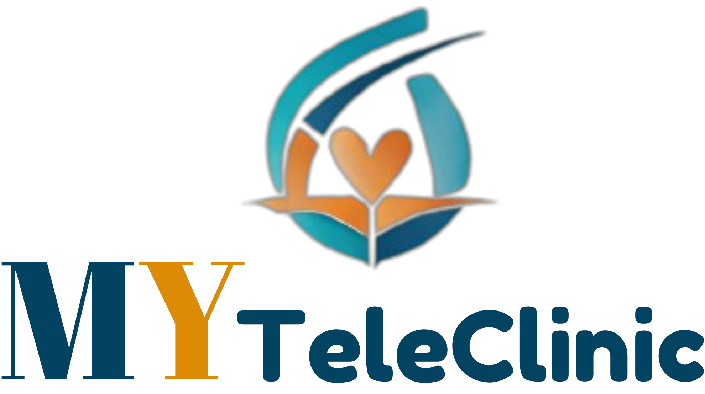
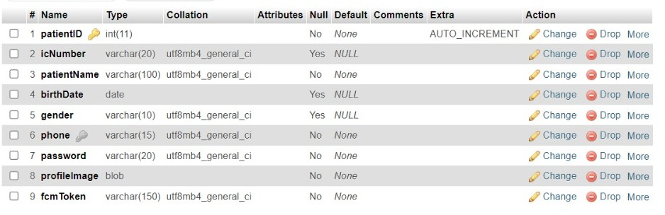
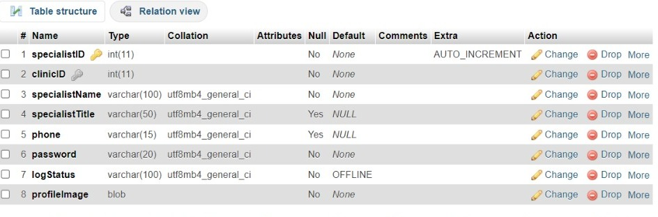
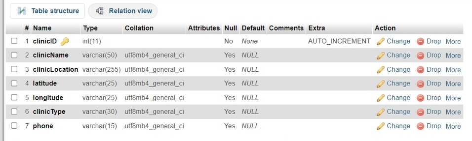
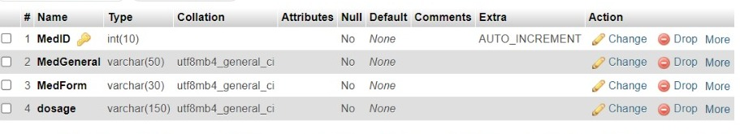
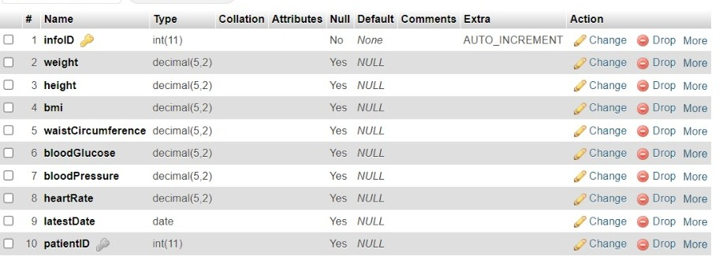
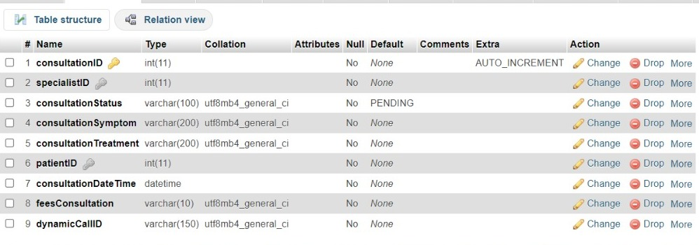

# MyTeleClinic Documentation

> This is the documentation for MyTeleClinic

---

### Table of Contents

- [Introduction](#introduction)
- [Objective](#objective)
- [Project Scope](#project-scope)
- [Hardware & Software used](#hardware-software)
- [Database Integration](#database-integration)
- [Conclusion](#conclusion)

---

## Introduction

MyTeleClinic is a healthcare application technology that is used to track healthcare and clinics nearby, making it easier for patients to locate and access medical services. It is also used to do online consultations with doctors and book online appointments with selected clinics. This application is an innovative solution to save time and energy for the citizens and make healthcare services more convenient.

[Back To The Top](#myteleclinic-documentation)

---

## Objective

- To develop a mobile application for enabling live online consultation between doctor and patient.
- To provide a platform for users to locate the nearest clinic by utilizing Google Map API.   
- To allow the patient to self-track their medical record.

[Back To The Top](#myteleclinic-documentation)

---

## Project Scope

#### Modules Developed
- User Authentication and Authorization module
- Clinic Tracker module
- Appointment scheduling module
- Search and Filter Module
- Telemedicine Integration module
- User Medical Record module

#### Target User
-Busy Professionals and Working Individuals: Individuals with hectic schedules looking for a convenient way to schedule medical appointments, track clinic visits, manage their medical records, and potentially engage in telemedicine for consultations.
-Elderly or Aging Population: Seniors who may have multiple healthcare appointments, medications, and health records to manage, often needing assistance and convenient apps to streamline healthcare interactions.
-Patients with Minor Illness Condition: Individuals dealing with minor illnesses or regular medical check-ups who need a tool to keep track of their appointments, medications, treatment plans, and consultations with healthcare providers.
-Patients in Rural or Underserved Areas: People living in remote or underserved areas with limited access to medical facilities, looking for telemedicine options and assistance in locating nearby clinics for necessary healthcare.

[Back To The Top](#myteleclinic-documentation)

---

## Hardware & Software Used

#### Hardware
- Server Infrastructure: MyTeleClinic relies on server infrastructure to host and manage the application, ensuring scalability and reliability.
- End-User Devices: Patients and healthcare providers access MyTeleClinic using various end-user devices, including desktop computers, laptops, tablets, and smartphones.

#### Software
- XAMPP: XAMPP serves as the local development environment, bundling Apache, MySQL, and PHP. It allows for the development and testing of the MyTeleClinic application before deployment.
- phpMyAdmin: phpMyAdmin is used for the administration of MySQL databases. It provides a user-friendly interface to manage database operations, ensuring efficient data handling for MyTeleClinic.
- Android Studio: Android Studio is the integrated development environment (IDE) for creating the Android application version of MyTeleClinic. It offers tools and resources for Android app development.  Dart is the programming language used, and Flutter serves as the UI toolkit for developing the MyTeleClinic application. These frameworks enable cross-platform development, ensuring a consistent user experience across different devices.
- Firebase: Firebase is a comprehensive platform utilized for various functionalities within MyTeleClinic, including real-time database management, cloud storage, and authentication services.
- OneSignal: OneSignal is employed for push notification services in MyTeleClinic for online consultation notification.
- Zego: Zego is integrated for video conferencing capabilities within MyTeleClinic, providing a reliable and secure solution for virtual consultations.
- GitHub: GitHub serves as a version control repository for the MyTeleClinic source code. It facilitates collaboration among developers, ensuring organized and traceable changes to the application.
- Postman: Postman is utilized for API testing during the development and integration phases of MyTeleClinic. It streamlines the testing and validation of API endpoints.

[Back To The Top](#myteleclinic-documentation)

## Database Integration

As mentioned, we used phpMyAdmin as our project database. While firebase is used to push notification to other user.
Here are the tables structure for our database :

#### patient

#### specialist

#### clinic

#### medicine

#### vital_info

#### consultation

#### medication

[Back To The Top](#myteleclinic-documentation)

## Conclusion
In conclusion, MyTeleClinic stands as a groundbreaking telemedicine platform with the potential to reshape the healthcare landscape through digital technology. While it brings forth several advantages and commercial values, identified weaknesses highlight areas for improvement to ensure enhanced user satisfaction and overall effectiveness.

[Back To The Top](#myteleclinic-documentation)